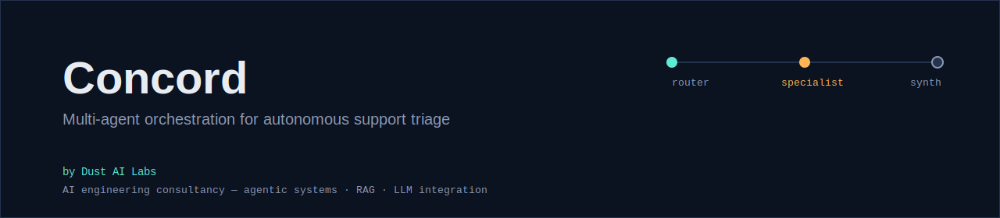

# Concord

[](https://github.com/dustailabs/Concord/actions/workflows/ci.yml)
[](./LICENSE)
[](https://dustailabs.github.io/Concord/)
[](https://www.typescriptlang.org/)

**A multi-agent orchestration framework for autonomous support triage.**

Concord takes a raw support ticket, routes it to the right specialist, drafts a
resolution, and writes a customer-facing reply — three coordinating AI agents,
one auditable pipeline.

Built by [Dust AI Labs](https://github.com/dustailabs) as a reference
implementation: the same pattern (router → specialist → synthesizer, with a
full trace at every step) generalizes to triage, classification, and decision
pipelines well beyond support tickets.

**[Live demo →](https://dustailabs.github.io/Concord/)**

---

## How it works

```
SupportTicket
     │
     ▼
 ┌─────────┐     category, confidence, reasoning
 │ Router  │ ───────────────────────────────────┐
 └─────────┘                                     │
                                                  ▼
                          ┌──────────────────────────────┐
                          │  Specialist (one of four)     │
                          │  billing · technical ·        │
                          │  account · general             │
                          └──────────────────────────────┘
                                          │  draft, requiresEscalation
                                          ▼
                                  ┌──────────────┐
                                  │ Synthesizer  │
                                  └──────────────┘
                                          │
                                          ▼
                          FinalResolution { customerReply, status }
```

Each step is a single, focused call to Claude with a narrow system prompt and
a strict JSON response contract — no agent sees more context than it needs,
and every step emits a `TraceEvent` before and after it runs. That's what
powers the live "dispatch board" in the demo, and it's also what makes the
pipeline straightforward to test: every agent function takes a plain client
object, so unit tests just hand it a fake one. No network mocking required.

## Project structure

```
packages/core    — the orchestration engine (@concord/core)
  src/agents/    — router, specialists, synthesizer
  src/orchestrator.ts
  tests/         — vitest, fully offline (fake clients, no real API calls)
apps/web         — the live demo (@concord/web), Vite + React + Tailwind
```

## Running it locally

```bash
npm install
npm run build --workspace=@concord/core
npm run dev --workspace=@concord/web
```

The demo's "Run a real ticket" section calls the Anthropic API directly from
your browser with your own API key — there's no backend, and the key never
leaves your session.

To use the engine from your own backend instead:

```ts
import { runTicket } from "@concord/core";

const { resolution, trace } = await runTicket(
  { id: "T-1", body: "I was charged twice this month." },
  { apiKey: process.env.ANTHROPIC_API_KEY!, onTrace: console.log },
);

console.log(resolution.customerReply);
```

## Testing

```bash
npm run test --workspace=@concord/core
```

Tests cover the router's classification parsing (including malformed and
markdown-fenced model output) and a full pipeline run with a stubbed client.

## Extending Concord

- **New specialist category**: add a domain prompt to `DOMAIN_PROMPTS` in
  `packages/core/src/agents/specialists.ts` and extend `SpecialistCategory`
  in `types.ts`.
- **New integration**: anything that can produce a `SupportTicket` and
  consume a `FinalResolution` can sit in front of or behind this pipeline —
  a Zendesk webhook, a Slack bot, a CLI.

## License

MIT — see [LICENSE](./LICENSE).

---

## About Dust AI Labs

Dust AI Labs is an AI engineering consultancy. We architect, build, and ship
production GenAI systems — agentic pipelines, retrieval-augmented knowledge
platforms, and LLM-driven automation — for FinTech, Healthcare, E-Commerce,
LegalTech, and Enterprise SaaS clients. Every engagement is built end-to-end
by a single senior practitioner: no offshoring, no junior pass-through.

Concord is one of several open-source reference builds — see the
[full profile, case studies, and engagement models →](https://github.com/dustailabs)

**Get in touch:** [dustailabs@proton.me](mailto:dustailabs@proton.me) ·
[book a discovery call](https://calendly.com/dustailabs-proton)

